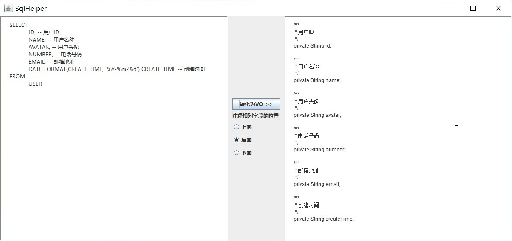

# SqlHelper
> 一个简单的SQL生成VO的工具，在开发中经常要根据执行的SQL写对应的VO类，手写的话还是很繁琐的，因此有了这么一个辅助工具，[可执行jar下载地址](jar/SqlHelper.jar)

## 使用
在界面左侧填写SQL，选择SQL中的字段注释的位置，点击“转化为VO”，则会在右侧生成对应的Java代码

	

## 说明
此工具并没有实际执行SQL，而是通过jsqlparser去解析SQL中的SELECT字段，复杂的SQL也基本可以正常解析

但是因为没有实际执行SQL，所以并不知道每个字段的实际类型，全部当做String类型处理。同时也需要给每个字段写上注释，还是稍显繁琐。在后期计划，准备增加数据库配置功能，直接执行SQL，这样便可以获取类型和注释